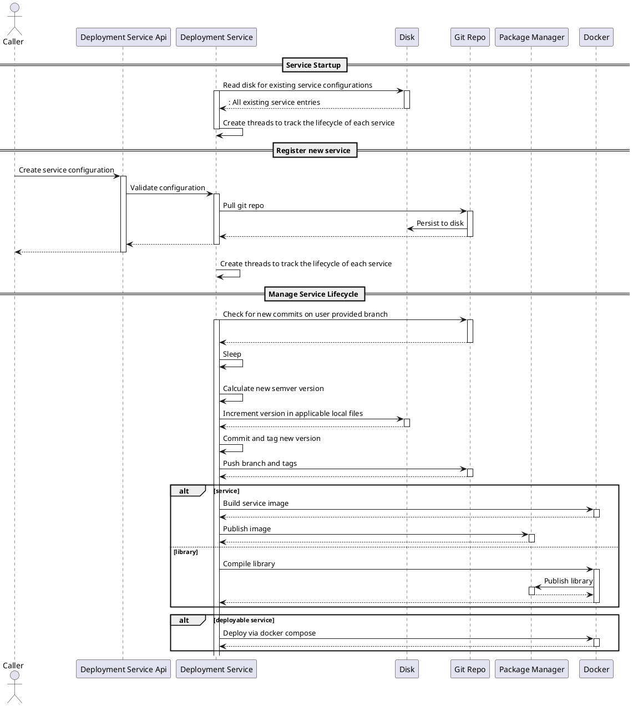

# Requirements

The deployment service must manage the CI/CD mechanism for the following service and library types:

- npm service (Docker container)
  - Deploy - run the service after building the image
  - No Deploy - just build the image
- go service (Docker container)
  - Deploy - run the service after building the image
  - No Deploy - just build the image
- npm library
- go library
- openapi
  - support auto-generating a npm and go client
  - keep clients up to date with version

The deployment service must manage the lifecycle of the customer's git repositories, including:

- Cloning existing git repositories for service and libraries
- Calculating next version using conventional commits
- Building the package based on configuration
- Deploying the package based on configuration
- Creating and managing git repositories for openapi npm and go clients

## AuthN and AuthZ

For ease of use for callers, callers can use an API Key, passed in the `x-api-key` header to call APIs.

## Data persistence

To keep dependencies minimal, this service will not make use of a database to store data. Instead, data will be stored in files persisted in the same configurable directory provided in `.env`.

## Service Configuration

Service configuration is provided via API request input.

Main configuration items include:

- `name`
- `configuration`
  - `npm`
    - `service`
      - `envPath`
      - `dockerfilePath`
      - `dockerComposePath`
    - `library`
  - `go`
    - `service`
      - `envPath`
      - `dockerfilePath`
      - `dockerComposePath`
    - `library`
  - `openapi`
    - `clientPackages`
      - `npm`
      - `go`
  - `nginx`
    - `envPath`
    - `dockerfilePath`
    - `dockerComposePath`

## API Endpoints

- `POST /services`
  - Creates service entry
- `GET /services/<id>`
  - Get information about a specific service, including deployment status
- `GET /services`
  - List information about all services, including deployment status

## Design

